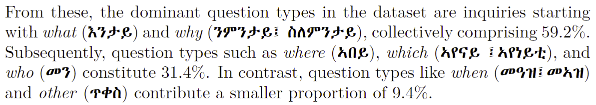

# TIGQA: An Expert-Annotated Question-Answering Dataset in Tigrinya

This is the official GitHub repository for our recently accepted LREC-Coling 2024 paper, "TigQA: An Expert-Annotated Question-Answering Dataset in Tigrinya." We will update this repository soon with links to the full Question-Answering dataset and other additional material. Please check out our paper for details!

    @article{Teklehaymanot_TigQA_2024,
          author = {Teklehaymanot, Hailay Kidu and Fazlija, Dren and Ganguly, Niloy and Patro, Gourab K. and Nejdl, Wolfgang},
          title = {TigQA: An Expert-Annotated Question-Answering Dataset in Tigrinya},
          month = may,
          year = 2024,
          publisher = {LREC-Coling},
    }


## FAQ

### What is TIGQA?
TigQA is an expert-annotated dataset in Tigrinya, a low-resource language spoken by approximately 10 million speakers in Eritrea and the Tigray region of Ethiopia. Our proposed SQuAD-like dataset contains 2,685 question-answer pairs covering 122 diverse topics such as climate, water, and traffic. These pairs are from 537 context paragraphs in publicly accessible Tigrinya and Biology books, with the answers being provided by teachers from the region.

### Where can I access TIGQA?
To reliably and accessibly store our dataset, we plan on publishing TIGQA on [Zenodo](https://zenodo.org/), an online platform designed to host datasets safely for a long time. We will update this README file as soon as the data is publicly available on the platform.

### How do I use Ge'ez script in LaTeX?
While working on this paper, we realized that incorporating Ge'ez script into LaTeX documents is not trivial. As such, we would like to provide you with a simple, helpful command that allows you to incorporate Ge'ez script into your existing English text.

> [!IMPORTANT]
> The command utilizes the fontspec package to display the Ge'ez script correctly. If you are working with Overleaf, you must change the compiler to either *XeLaTeX* or *LuaLaTeX*!

**Step 1:** Add the following code and packages prior to the `\begin{document}` term  
```latex
%-----------Used for Geez Script---------------------
\usepackage{polyglossia}

\setmainlanguage{english}
\setotherlanguage{amharic}

\newfontface{\amharicfont}{Abyssinica SIL}

\newenvironment{geez}
  {\amharic}
  {\endamharic}
%-----------------------------------------------------
```

**Step 2:** You can now use the environment `\begin{geez} ... \end{geez}` within your text to correctly display your Ge'ez script (without messing up the font of your English text!). Here is an example from the TIGQA paper:
```latex
From these, the dominant question types in the dataset are inquiries 
starting with \textit{what} (\begin{geez}እንታይ\end{geez}) and \textit{why} 
(\begin{geez}ንምንታይ፤ ስለምንታይ\end{geez}), collectively comprising 59.2\%. 
Subsequently, question types such as \textit{where} (\begin{geez}ኣበይ\end{geez}),
\textit{which} (\begin{geez}ኣየናይ ፤ኣየነይቲ\end{geez}), and \textit{who} (\begin{geez}
መን\end{geez}) constitute 31.4\%. 
In contrast, question types like \textit{when} (\begin{geez}መዓዝ፤መኣዝ\end{geez})
and \textit{other} (\begin{geez}ጥቀስ\end{geez}) contribute a smaller proportion of 9.4\%.
```

This code snippet results into the following PDF output:

