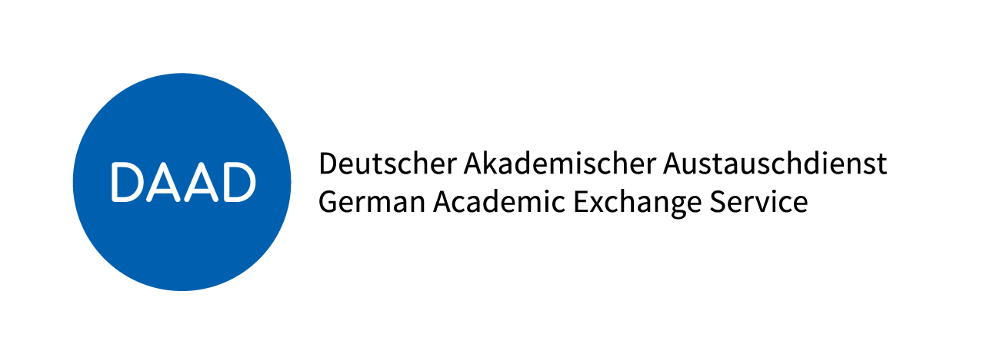

# TIGQA: An Expert-Annotated Question-Answering Dataset in Tigrinya

[](LICENSE)
[](https://doi.org/10.5281/zenodo.11423986)
[](https://github.com/hailaykidu/TigQA-Dataset)
[](https://arxiv.org/abs/2404.17194)
[](https://aclanthology.org/2024.lrec-main.1404/)


<p align="center">
  
  
</p>

<p align="center">
  
</p>

<p align="center">
  <a href="https://www.linkedin.com/in/hailay-kidu-teklehaymanot-679872328/">Hailay Kidu Teklehaymanot</a><sup>1</sup>,
  <a href="https://www.linkedin.com/in/drenfazlija">Dren Fazlija</a><sup>1</sup>,
  <a href="https://www.linkedin.com/in/niloyganguly/">Niloy Ganguly</a><sup>2</sup>,
  <br>
  <a href="https://www.linkedin.com/in/gourabgggg/">Gourab K. Patro</a><sup>1,2</sup>,
  <a href="https://www.linkedin.com/in/wolfgangnejdl/">Wolfgang Nejdl</a><sup>1</sup>
  <br>
  <sup>1</sup>L3S Research Center, Leibniz University Hannover, Germany
  <br>
  <sup>2</sup>Department of Computer Science and Engineering, IIT Kharagpur, India
</p>

<details>
  <summary>Abstract (click to expand)</summary>
  <em>The absence of explicitly tailored, accessible annotated datasets for educational purposes presents a notable obstacle for NLP tasks in languages with limited resources. This study initially explores the feasibility of using machine translation (MT) to convert an existing dataset into a Tigrinya dataset in SQuAD format. As a result, we present TIGQA, an expert-annotated dataset containing 2,685 question-answer pairs covering 122 diverse topics such as climate, water, and traffic. These pairs are from 537 context paragraphs in publicly accessible Tigrinya and Biology books. Through comprehensive analyses, we demonstrate that the TIGQA dataset requires skills beyond simple word matching, requiring both single-sentence and multiple-sentence inference abilities. We conduct experiments using state-of-the-art MRC methods, marking the first exploration of such models on TIGQA. Additionally, we estimate human performance on the dataset and juxtapose it with the results obtained from pre-trained models. The notable disparities between human performance and the best model performance underscore the potential for future enhancements to TIGQA through continued research. Our dataset is freely accessible via the provided link to encourage the research community to address the challenges in the Tigrinya MRC.</em>
</details>

## Motivation of this Project
Tigrinya lacks dedicated, high-quality QA datasets essential for NLP research. By exploring machine translation plus expert annotation, this project aims to bridge that resource gap and empower QA development in underrepresented languages.

## What is Tigrinya?

Tigrinya is a **Semitic language spoken by an estimated 7–10 million people**, primarily in **Eritrea** and northern **Ethiopia**.  
Despite its widespread use, Tigrinya remains **severely underrepresented in natural language processing (NLP)**.  
Building resources for Tigrinya is not only an academic challenge—it has real-world impact: enabling **digital services, educational tools, and inclusive AI applications** that reach millions of speakers currently underserved by technology.  


## Dataset Access and Licensing

The **TIGQA dataset** is publicly available for research purposes.  
- **Size**: 2,685 question–answer pairs across 122 diverse topics  
- **Format**: SQuAD-style, JSON structured for compatibility with QA models  
- **Sources**: Tigrinya and biology textbooks, refined via expert annotation  


## Annotation Process

TIGQA was developed through a **hybrid pipeline**:  
1. **Machine Translation (MT)** was used to convert existing QA resources into Tigrinya.  
2. **Expert annotators** refined these translations—ensuring that questions were natural, unambiguous, and directly answerable from the context passages.  
3. **Quality checks** were applied to guarantee that answers aligned with the text and captured the intended meaning.  

This combination of MT efficiency with **human expertise** helped create a **high-quality, trustworthy resource** despite limited prior digital materials for Tigrinya.  


## Key experimental findings
- Crafted TIGQA: 2,685 expert-annotated QA pairs across 122 topics, from 537 context passages.
- Requires deep inference: models must go beyond word matching, handling both single- and multi-sentence reasoning.
- Benchmarked leading MRC models—revealed clear room for improvement when compared to humans.


## Take-home message
TIGQA is a valuable, freely accessible resource that confirms expert-curated QA datasets are both feasible via MT pipelines and critically needed in low-resource contexts. Current model performance lags behind human-level understanding, offering fertile ground for future research.
## Citation
```bibtex
@inproceedings{teklehaymanot-etal-2024-tigqa,
    title = "{TIGQA}: An Expert-Annotated Question-Answering Dataset in {T}igrinya",
    author = "Teklehaymanot, Hailay Kidu  and
      Fazlija, Dren  and
      Ganguly, Niloy  and
      Patro, Gourab Kumar  and
      Nejdl, Wolfgang",
    editor = "Calzolari, Nicoletta  and
      Kan, Min-Yen  and
      Hoste, Veronique  and
      Lenci, Alessandro  and
      Sakti, Sakriani  and
      Xue, Nianwen",
    booktitle = "Proceedings of the 2024 Joint International Conference on Computational Linguistics, Language Resources and Evaluation (LREC-COLING 2024)",
    month = may,
    year = "2024",
    address = "Torino, Italia",
    publisher = "ELRA and ICCL",
    url = "https://aclanthology.org/2024.lrec-main.1404/",
    pages = "16142--16161",
    abstract = "The absence of explicitly tailored, accessible annotated datasets for educational purposes presents a notable obstacle for NLP tasks in languages with limited resources. This study initially explores the feasibility of using machine translation (MT) to convert an existing dataset into a Tigrinya dataset in SQuAD format. As a result, we present TIGQA, an expert-annotated dataset containing 2,685 question-answer pairs covering 122 diverse topics such as climate, water, and traffic. These pairs are from 537 context paragraphs in publicly accessible Tigrinya and Biology books. Through comprehensive analyses, we demonstrate that the TIGQA dataset requires skills beyond simple word matching, requiring both single-sentence and multiple-sentence inference abilities. We conduct experiments using state-of-the-art MRC methods, marking the first exploration of such models on TIGQA. Additionally, we estimate human performance on the dataset and juxtapose it with the results obtained from pre-trained models. The notable disparities between human performance and the best model performance underscore the potential for fu- ture enhancements to TIGQA through continued research. Our dataset is freely accessible via the provided link to encourage the research community to address the challenges in the Tigrinya MRC. Keywords: Tigrinya QA dataset, Low resource QA dataset, domain specific QA"
}
```